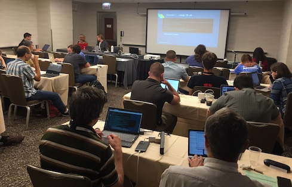

# Tutorial on Floating-Point Analysis and Reproducibility Tools for Scientific Software
#### Los Alamos National Laboratory <br />
January, 2020 <br />
Time: 9:00am - 12:15pm (half-day tutorial) <br />

Part of the this tutorial was presented at SC19 (see [here](/sc19/))

<p align="center">   </p>

<p align="center">   </p>

## Presenters

* [Ignacio Laguna](http://lagunaresearch.org/) (organizer), Lawrence Livermore National Laboratory
* Michael Bentley, University of Utah
* Ian Briggs, University of Utah
* [Ganesh Gopalakrishnan](https://www.cs.utah.edu/~ganesh/), University of Utah


### Schedule

| Time | Module | Presenter | Slides |
|------|--------|-----------|--------|
| 9:00 - 9:10am | Introduction (housekeeping) |  Ignacio | [slides](./slides/intro-Ignacio.pdf) |
| 9:10 - 9:30am | Floating-point background |  Ganesh | [slides](./slides/Ganesh_introduction.pdf) |
| 9:30 - 10:00am |  **FPChecker**:  floating-point exceptions, GPUs, CUDA | Ignacio          | [slides](./slides/Module-FPChecker.pdf)|
| 10:00 - 10:15am     |  Break or Q&A       |           |        |
| 10:15 - 10:45am |  **ARCHER**:  data races, OpenMP  | Ian          | [slides](./slides/Module-ARCHER.pdf)|
| 10:45 - 11:30am |  **FLiT**: floating-point variability, compiler optimizations  | Ian          | [slides](./slides/Module-FLiT.pdf)|
| 11:30 - 12:00pm |  **ReMPI**: MPI, floating-point variability  | Ignacio, Ian          | [slides](./slides/Module-ReMPI.pdf)|
| 12:00 - 12:15pm |  Q&A      |           |        |


### Access to AWS Instances

We provide exercises for each module in AWS instances. You can get a username, password,
along with the IP address of an instance [here](https://integrus.cs.utah.edu/). 
You can access the instance via ssh as follows:

```
ssh [USERNAME]@[IP ADDRESS]
```

### Directory Structure

The directory structure in your home directory will look like this:

```
/home/user1/
   |---Module-TOOL1
      |---exercise-1
      |---exercise-2
      |---exercise-3
   |---Module-TOOL2
      |---exercise-1
      |---exercise-2
      |---exercise-3
   ...
```

Each module directory contains directories for each exercise. Please run the exercises in each of them as indicated
by the speaker.


