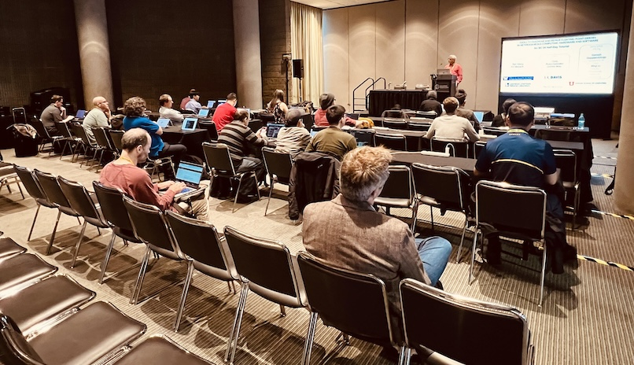

# Tools to Diagnose and Repair Floating-Point Errors in Heterogeneous Computing Hardware and Software

#### SC24, Atlanta, Georgia  
Nov 17, 2024  

Time: 1:30pm - 5pm EST (half-day tutorial)  

   

## Presenters

* Ganesh Gopalakrishnan, University of Utah
* Cindy Rubio-Gonzalez, University of California, Davis
* Xinyi Li, University of Utah
* Dolores Miao, University of California, Davis
* Edward Misback, University of Washington

### Presentation Slides

* [Introduction](./slides/TOPIC0-Intro-Material-First-and-Second-Halves.ppt.pdf)
* [Odyssey](./slides/TOPIC1-Odyssey.pdf)
* [Ciel](./slides/TOPIC2-Ciel.pptx.pdf)
* [GPU-FPX](./slides/TOPIC3-GPU-FPX-and-FTTN.pptx.pdf)

