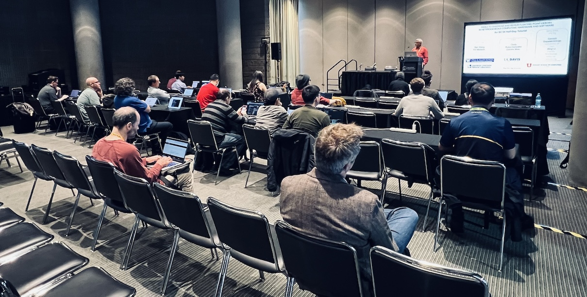

# Tools To Detect and Diagnose Floating-Point Errors in Heterogeneous Computing Hardware and Software

#### SC25, St. Louis, MO  
Nov 16, 2025  

Time: 8:30pm - 12pm CST (half-day tutorial)  
Location: America’s Center Convention Complex, Room 121  

## [Click Here for Tutorial Slides (PDF)](./slides/SC25-Tutorial-FP_tools.pdf)

   

## Description

High-performance computing and machine learning applications increasingly rely on mixed-precision arithmetic on CPUs and GPUs for superior performance. However, this shift introduces several challenging numerical issues such as increased round-off errors, and INF and NaN exceptions that can render the computed solutions useless. 

At present, this places a heavy burden on developers, interrupting their work while they diagnose these problems manually. This tutorial presents three tools that target specific issues leading to floating-point bugs. 

First, we present **FPChecker**, which not only detects and reports INF/NaN exceptions in parallel and distributed CPU codes, but also tells programmers about the exponent value ranges for avoiding exceptions while also minimizing rounding errors. 

Second, we present **GPU-FPX**, which detects floating-point exceptions generated by NVIDIA GPUs, including their Tensor Cores via a "nixnan" extension to GPU-FPX. 

Third, we present **FloatGuard**, a unique tool that detects exceptions in AMD GPUs. The tutorial is aimed at helping programmers avoid exception bugs; for this, we will demonstrate our tools on simple examples with seeded bugs. Attendees may optionally install and run our tools. 

The tutorial also allocates question/answer time to address real situations faced by the attendees.

## Note for Attendees

An overview video of the tutorial is at [https://lnkd.in/g6tU8FEV](https://lnkd.in/g6tU8FEV)).

* **FPChecker** is about LLVM-based Floating-Point Exception Tracing. Those who want to follow along the FPChecker exercises on Mac OS or Linux may kindly install the [Conda](https://www.anaconda.com/) environment (instructions for Mac are provided at [https://youtu.be/DNu8pQOYRGg](https://youtu.be/DNu8pQOYRGg).
* **GPU-FPX** (and its extension NixNan), will be a demo-only presentation of NVIDIA SIMT-Core and Tensor-Core Binary Instrumentation-based Floating-Point Exception Tracing.
* **FloatGuard**, the third and final part of the tutorial will be a demo-only presentation of AMD GPU Binary Instrumentation-based Floating-Point Exception Tracing.

## Presenters

* [Ganesh Gopalakrishnan](https://users.cs.utah.edu/~ganesh/), University of Utah
* [Ignacio Laguna](https://lagunaresearch.org/), Lawrence Livermore National Laboratory
* [Cindy Rubio-González](https://web.cs.ucdavis.edu/~rubio/), University of California, Davis
* Dolores Miao, University of California, Davis
* Mark Baranowski, University of Utah

### Presentation Slides

* [Introduction](slides/tutorial_intro.pdf)
* [FPChecker](slides/FPChecker_tutorial.pdf)
* [NixNan](slides/NixNaN.pdf)
* [FloatGuard](slides/FloatGuard.pdf)

## Repositories:
* FPChecker: [https://github.com/LLNL/FPChecker](https://github.com/LLNL/FPChecker), [Documentation](https://fpchecker.org)
* NixNaN: 
* FloatGuard: [https://github.com/LLNL/FloatGuard](https://github.com/LLNL/FloatGuard)
