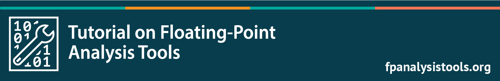

## Tutorial Material

- [SC25](/SC25), Nov, 2025
- [SC24](/SC24), Nov, 2024
- [LANL](/LANL), January, 2020
- [SC19](/sc19), Denver, Colorado, USA, Nov 17th, 2019
- [PEARC19](/pearc19), Chicago, Illinois, USA, Jul 30th, 2019

## Background

<!--

-->

Dealing with floating-point arithmetic in numerical computations presents significant hurdles. Round-off errors are pervasive, not only occurring initially when representing real numbers, but also accumulating throughout the computation. Furthermore, factors like aggressive compiler optimizations and the use of lower precision arithmetic can dramatically alter the final results. The increasing prevalence of accelerators in High-Performance Computing (HPC) systems exacerbates these difficulties, demanding that computational scientists navigate even greater complexities to ensure their floating-point programs are both reliable and reproducible.  
Our tutorials showcase currently available tools designed to aid in the analysis of scientific software dealing with floating-point numbers.

## Presentations

- 03/05/2026: [__Compiler-Assisted Relative Error Analysis for Floating-Point: Tools and Reproducibility Challenges__](/slides/ilaguna-SIAM-2026.pdf), Ignacio Laguna, [SIAM PP 2026](https://www.siam.org/conferences-events/siam-conferences/pp26/program/program-and-abstracts/), Berlin, Germany.
- 02/04/2020: [__Improving Reliability Through Analyzing and Debugging Floating-Point Software__](/slides/ignacio_laguna_ECP_2020.pdf), Ignacio Laguna, [2020 ECP Annual Meeting](https://ecpannualmeeting.com/),  Houston, TX.
- 01/07/2020: [__Tools and Techniques for Floating-Point Analysis__](/slides/webinar-IDEAS-ilaguna.pdf), Ignacio Laguna, LLNL.

## Tools

### FPChecker

FPChecker is tool to detect floating-point exceptions (e.g.,
NaNs, division by zero) and profile floating-point behavior. 
It uses clang/LLVM to compile and
instrument code. The tool informs to users the location where 
exceptions occurred (file and line number), and can be used
in MPI and OpenMP programs.

[https://github.com/LLNL/FPChecker](https://github.com/LLNL/FPChecker)

### FLiT

FLiT (Floating-point Litmus Tests) is a C++ test 
infrastructure for detecting variability in 
floating-point code caused by variations in 
compiler code generation, hardware and execution environments.

[https://github.com/PRUNERS/FLiT](https://github.com/PRUNERS/FLiT)

### ADAPT

ADAPT is a tool for mixed precision analysis. The tool uses 
algorithmic differentiation to estimate the output error due to 
lowering the precision of variables. ADAPT also provides a floating-point 
rounding error sensitivity profile of the code. 

[https://github.com/LLNL/adapt-fp](https://github.com/LLNL/adapt-fp)

### Precimonious

Precimonious is a framework to automatically tune
the precision of floating-point variables. The tool allows users to specify
a target error and performance threshold, and uses the clang/LLVM compiler
a main compiler infrastructure.

[https://github.com/corvette-berkeley/precimonious](https://github.com/corvette-berkeley/precimonious)

### HiFPTuner

HiFPTuner is a dynamic precision tuner. Different from other tuners, it explores the community structure of the floating-point variables and uses the community structure to guide precision tuning to find better precision configurations in less time.

[https://github.com/ucd-plse/HiFPTuner](https://github.com/ucd-plse/HiFPTuner) 

### FloatSmith

FloatSmith provides automated source-to-source tuning and transformation of floating-point code for mixed precision using three existing tools: 1) CRAFT, 2) ADAPT, and 3) TypeForge. The primary search loop is guided by CRAFT and uses TypeForge to prototype mixed-precision versions of an application. ADAPT results can optionally be used to help narrow the search space, and there are a variety of options to customize the search.

[https://github.com/crafthpc/floatsmith](https://github.com/crafthpc/floatsmith)

### FPBench

FPBench provides benchmarks, compilers, and standards for the floating-point research community.

[https://github.com/FPBench/FPBench](https://github.com/FPBench/FPBench)

